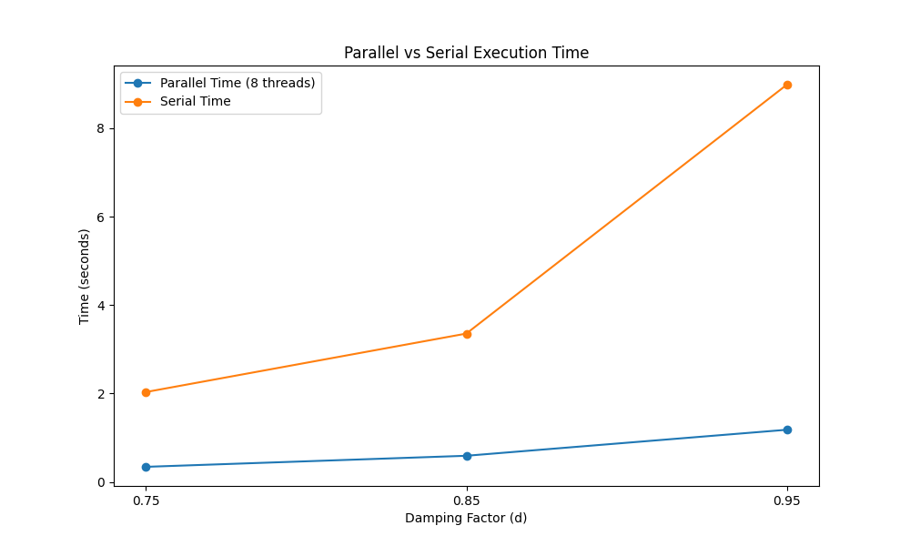
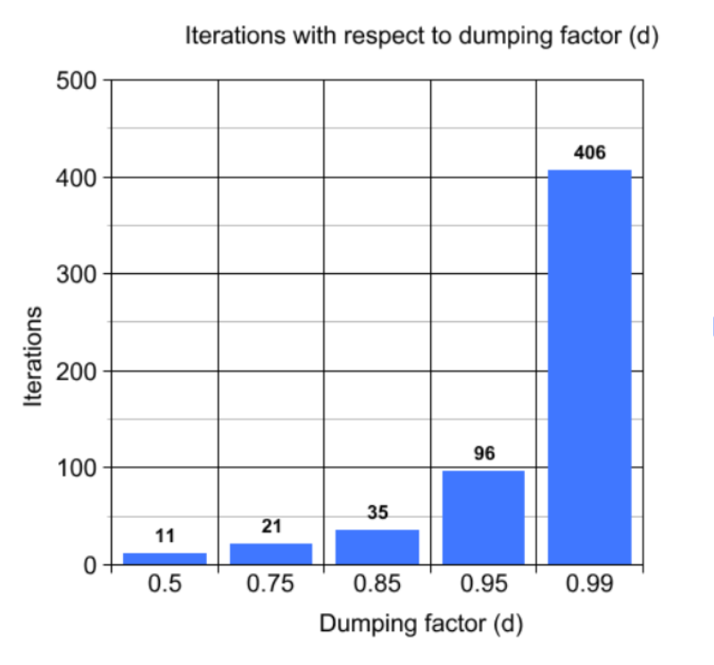

# Parallel and Serial Implementation of PageRank Algorithm

This repository contains the implementation of the PageRank algorithm using both parallel (OpenMP) and serial approaches. The provided code and performance results demonstrate the impact of parallelization on the execution time of the PageRank algorithm for different damping factors. 
This project was created as part of a course in Parallel and Distributed Systems. A PDF report with a previous version of the code is also included in this repository.

## Contents

- __serial.c__: Source code for the serial implementation of the PageRank algorithm.
- __parallel.c__: Source code for the parallel implementation of the PageRank algorithm using OpenMP.
## Prerequisites and how to run

A C compiler supporting OpenMP (e.g., GCC) and OpenMP is installed and configured on your system.

To compile and run the serial version:
```
gcc -o serial serial.c -lm
./serial 
```
For the parallel version:
```
gcc -fopenmp -o parallel parallel.c -lm
./parallel
```


## Data

For the exercise data, the __hollins.dat__ file was used. It contains the number of nodes and connections in the first row, followed by the names of all websites, and finally the connections.

Initially, the number of nodes and connections is stored, and then an array of strings with the names of the websites is created (for printing after executing PageRank). Then, an `n x n` matrix `S` is created, where a 1 is placed when page `i` has an outlink to page `j`. This matrix is called the adjacency matrix and is the basis of the PageRank algorithm.

## PageRank Algorithm

The PageRank algorithm primarily used source __[3]__ in combination with __[4]__. Below are the steps taken:

__Dangling Pages:__ After creating the `S` (adjacency) matrix, dangling nodes (websites with no outlinks) must be managed. It is assumed that a random user reaching such a page will go equally likely to any other website in the dataset. Therefore, an `outlinks[n]` vector is created to store the number of outlinks each website has. Using the formula from __[3]__, the S matrix is made stochastic (row-wise). For dangling pages, `1/n` is placed in the entire row of `S`. Finally, the `S` matrix is transposed to `St` to be stochastic column-wise.


__Teleportation:__ To fully define the optimal website problem, consider that a user can type the website address directly without using any outlink. Thus, the variable `d` (provided by the user) is defined according to the formula:


where `T` is a vector where all values are the equal probability `1/n`. The `G` matrix is not created at this stage since the goal is to define the problem `Ax = b` as in Chapter 5.1 (source __[3]__).

__Definition of Ax = b:__ According to the sources, 


and


are implemented in the code. The Gauss-Seidel algorithm is then iteratively executed on the system Ax = b to find its solutions.
## Gauss-Seidel Algorithm

PageRank algorithm was implemented using the Gauss-Seidel iterative method. The selected algorithm for the Gauss-Seidel implementation is as follows __[1]__:

In each iteration of the algorithm, unlike the Jacobi method, the values that have already been calculated are utilized. For example, for the calculation of the values that have already been calculated are used instead of the values that were calculated previously. For the remaining values that are unknown, the previous values are used. Below is the explanation of the serial Gauss-Seidel method.

To implement the above algorithm, two arrays of size `n` are created: `pageRank` and `shift`. The `pageRank` array contains the old values in each iteration as well as the values calculated up to that iteration. If the iteration is at step `i`, then the elements of `pageRank` up to the `i-1` variable contain the new values. The `shift` array calculates the shift that needs to be made in each iteration, according to the formula, to bring `pageRank` closer to the correct solution.

A `while` loop follows, where the Gauss-Seidel method is performed within it. In each iteration of the algorithm, the error is calculated as the sum of all shifts made at all points of the `pageRank` vector. When this error is less than 0.000001, it means the vector is moving very little, indicating that the solution is a good approximation of the actual solution, and thus the algorithm stops.

Exiting the `while` loop, the final scores for each website are stored in the `pageRank` array. The only task left is to sort them.

The formula used in the Gauss-Seidel method is:


## Verify Results

After completing the Gauss-Seidel algorithm, I used the Bubble Sort algorithm to sort the websites in descending order. The final results were printed from the `websites` array along with the PageRank of each website. 

The correctness of the results was verified by comparing them with Appendix B of source __[4]__. Both the PageRank values and the positions of the top websites were confirmed. Some minor differences in website names were observed, but these did not affect their ranking or PageRank values. Therefore, I believe the algorithm is correct, with minor discrepancies due to differences in the two datasets used, which are based on real data. 

For reference, the source __[4]__ results are shown above, and the results of my code for `d = 0.75` are shown below:



Below is a helpful graph of iterations with respect to dumping factor:



## References

[1] [Iterative Methods for Solving Ax = b](https://www.maa.org/press/periodicals/loci/joma/iterative-methods-for-solving-iaxi-ibi)

[2] [Limfinity IR](https://www.limfinity.com/ir/)

[3] [The PageRank Problem](https://repository.tudelft.nl/islandora/object/uuid:0483fd00-117d-43a3-b61f-6ce8a178e709?collection=education)

[4] [Modeling the Web and the Computation of PageRank](https://www.limfinity.com/ir/kristen_thesis.pdf)

[5] [Adaptive methods for the computation of PageRank](https://www.sciencedirect.com/science/article/pii/S0024379504000023)
